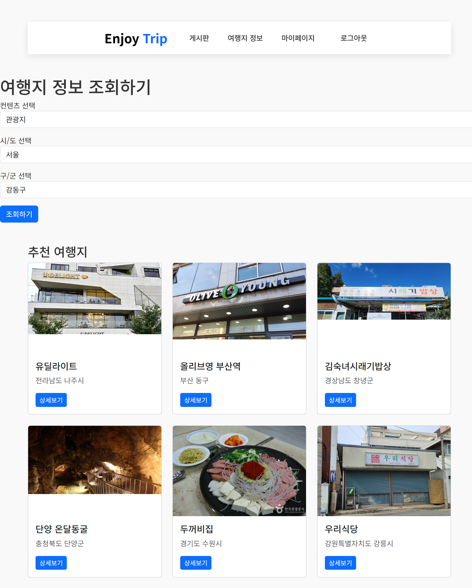
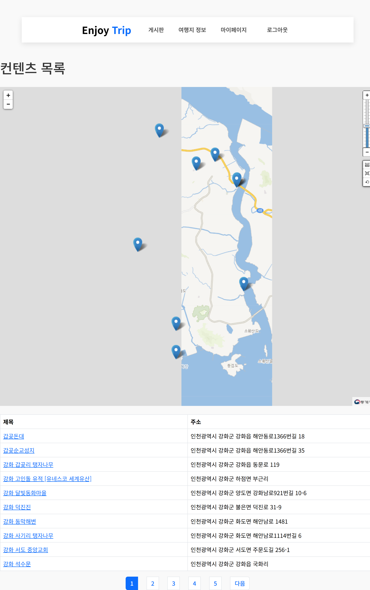
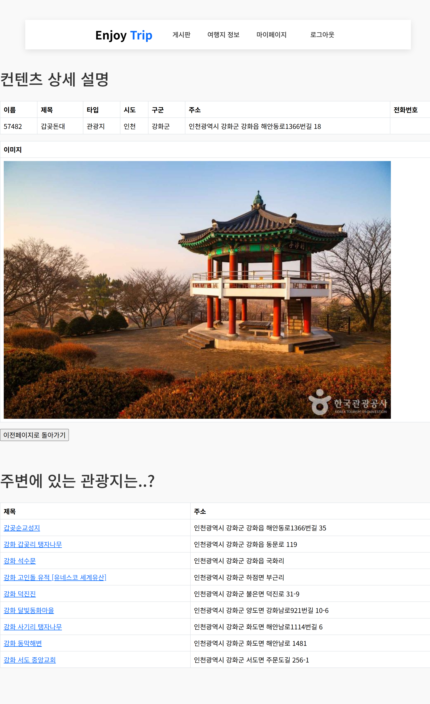
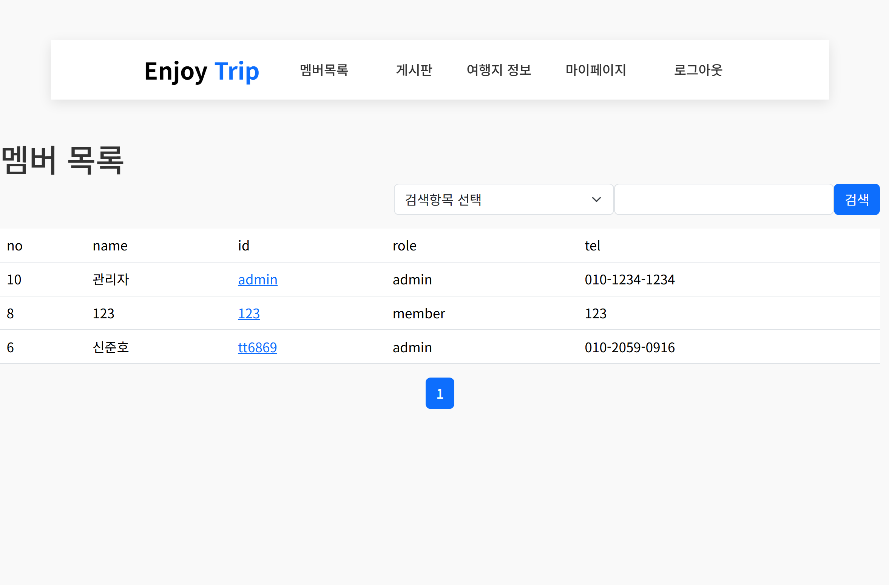
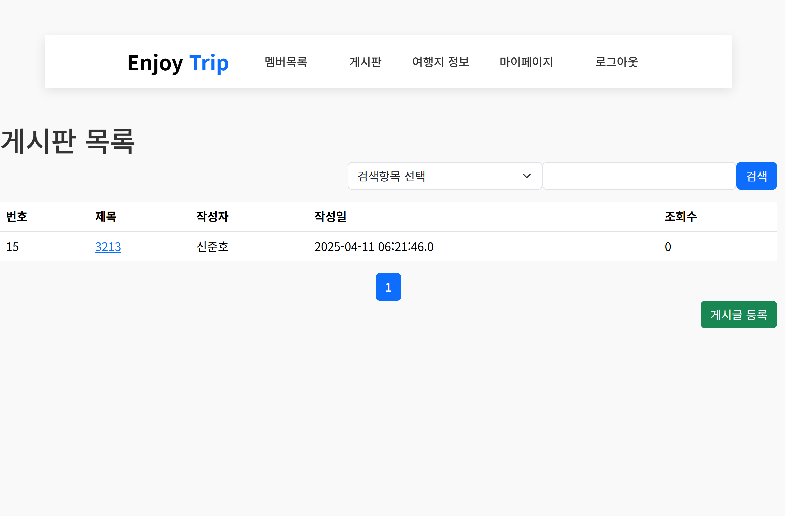

Trip_Spring_Gwangju_04_신준호_신규원
📗 프로젝트 개요

본 프로젝트는 SSAFY 13기 전공 자바반에서 진행하는 관통 프로젝트입니다.
공공데이터를 활용한 ENJOY_TRIP 서비스 개발
Web MVC Architecture 기반의 Enterprise Web Application 개발을 목표로 합니다.

📘 프로젝트 요약

Spring Framework를 활용한 웹 서버 구축
MyBatis Framework를 활용한 DB 연동
MVC 디자인 패턴 적용으로 확장성과 유지보수성 향상
한국관광공사의 국문관광정보서비스 API 활용한 지역별 관광지 정보 제공

📙 개발 환경

개발언어 및 프로그램

프론트엔드: HTML, CSS, JavaScript, JSP
백엔드: Java, Spring Boot
데이터베이스: MySQL
개발도구: STS
웹서버: Tomcat

사용 프레임워크

Spring Framework(Spring Boot)
MyBatis Framework

##### 1) [메인화면]

|         로그인 전 페이지       |           로그인 후 페이지            |
| :---------------------------------: | :---------------------------------: |
|  |  |

##### 2) [관광지 조회]

|        조회 전 페이지      |           조회 후 페이지            |
| :---------------------------------: | :---------------------------------: |
|  |  |

##### 5) [관광지 상세 정보 조회]
|           관광지 상세 정보 조회           |        조회 후 페이지        |
| :---------------------------------: | :---------------------------------: |
|   |  |

##### 6) [부가 기능]

|        맴버 목록      |            게시판           |
| :---------------------------------: | :---------------------------------: |
|  |  |

